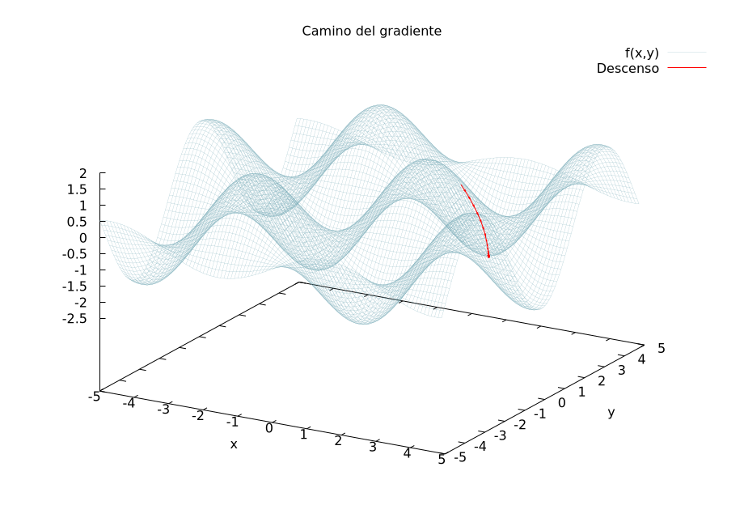

# NumGlaciar

I couldn't use [Armadillo](http://arma.sourceforge.net/) for my numerical methods course, so I kinda cloned the functionallities I use the most from that library and used the to implement several numerical methods algorithms.

* The `src/MATRIX` module holds the armadillo pseudo-clone.
* `src/LINALG` holds several numerical algorithms for solving linear systems of equations, calculating eigenvalues and decomposing matrices.
* `src/INT` and `src/DIFF` are for automatic integration and diferentiation.

To run the examples, use the data in the `data` folder.

